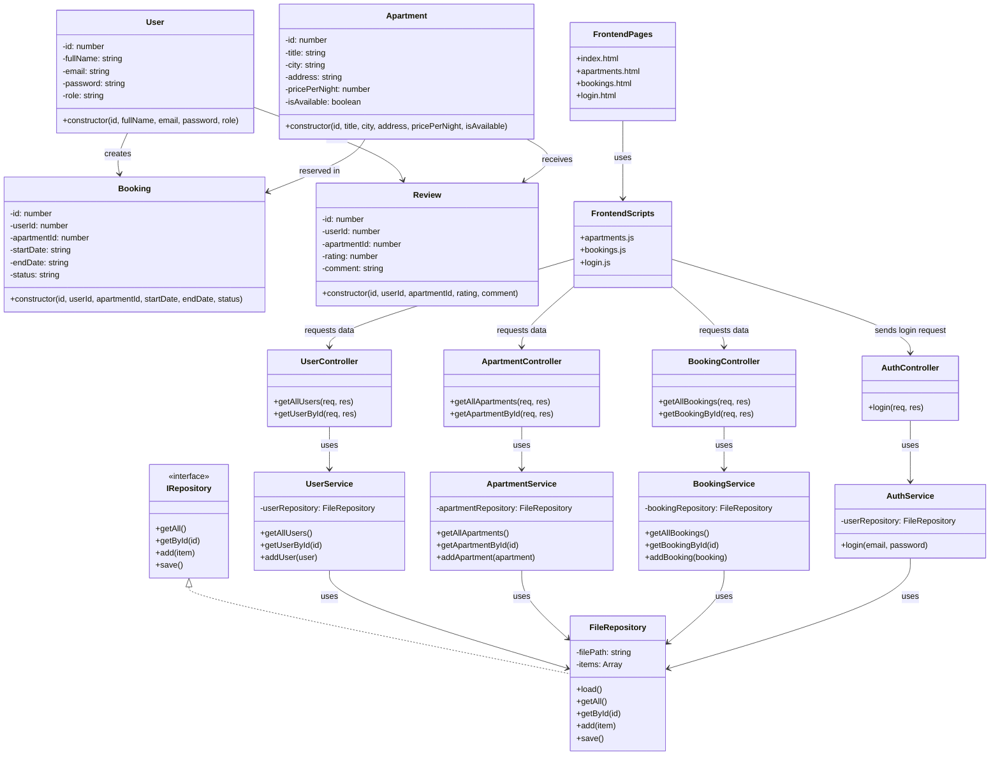

# Class Diagram

This class diagram presents the main architectural components of the Apartment Rental Management System.

It reflects the layered structure of the project:
- Models for domain entities
- Data layer for file-based persistence
- Services for business logic
- UI for controllers, routes, and frontend interaction

## UML Class Diagram

---

## Relationships Summary

- One user can create many bookings.
- One apartment can appear in many bookings.
- One user can write many reviews.
- One apartment can receive many reviews.
- Services use FileRepository for data access.
- Controllers call Services.
- Frontend communicates with backend endpoints through controllers and routes.

---

# Notes
- The diagram represents the main system structure using a layered approach (Models, Repository, Services, Controllers, Frontend).
- IRepository is used as an interface to enable flexible data access and easy replacement of storage implementation.
- FileRepository provides a simple file-based persistence mechanism used by all services.
- Services contain the core business logic and act as a bridge between controllers and data access.
- Controllers handle requests and delegate operations to the appropriate services.
- The frontend communicates with backend controllers through API calls.
- Relationships between User, Apartment, Booking, and Review reflect real-world rental system interactions.

---